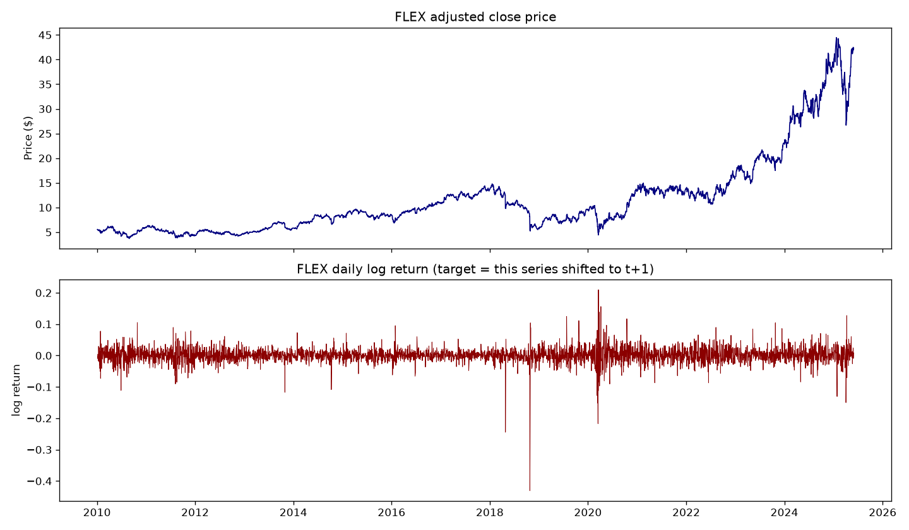
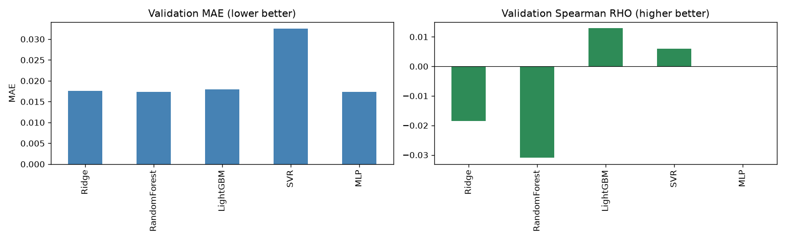
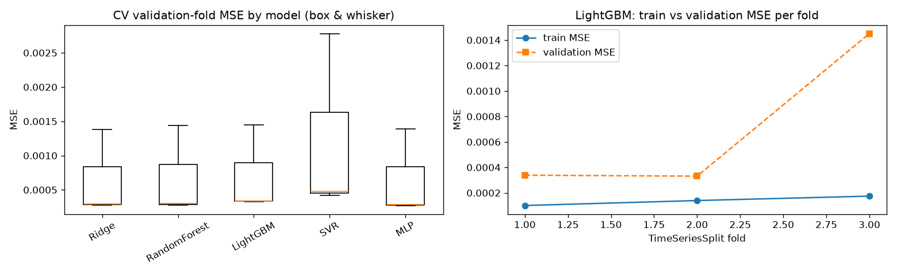
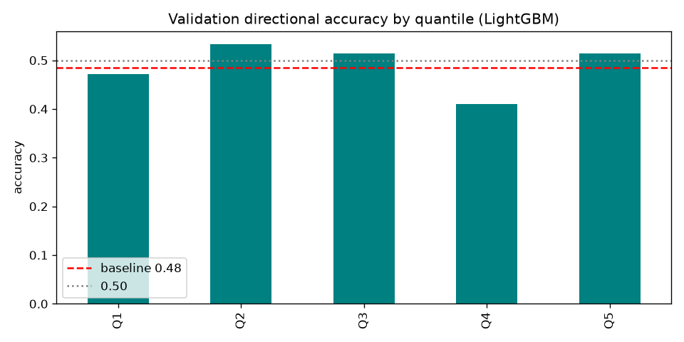
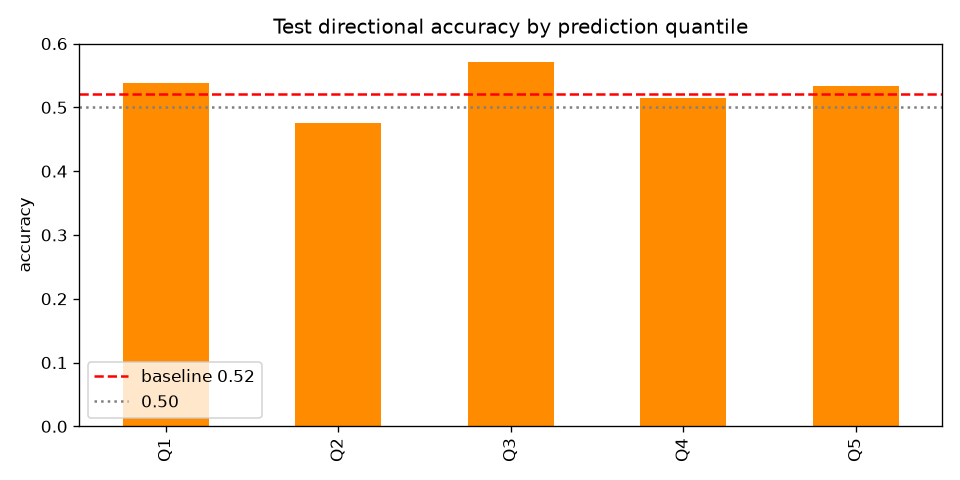
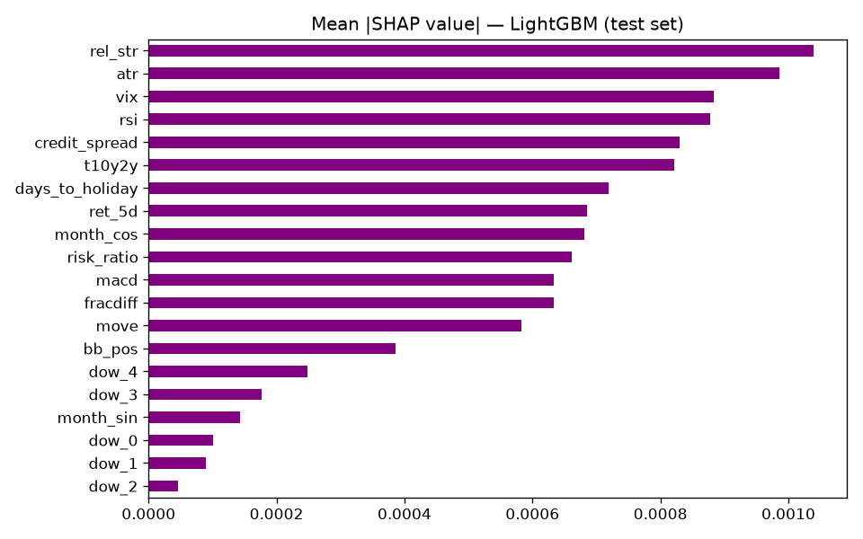
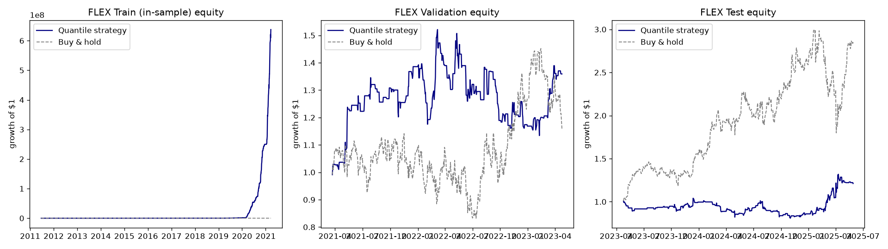

# APS1052 Course Project — Final Report / Presentation

## FLEX Daily Log-Return Forecasting & Quantile Trading

**Team:** Yicheng Yao, Jarvis Wang, JiangChuan Yu
**Target:** FLEX (Flex Ltd.) — mid-cap, Information Technology
**Deliverable format:** 30 slides with extensive speaker notes (this document)
**Companion notebook:** `FLEX_LogReturn_Trading.ipynb`

> This document is written as 30 slides. Each slide has a **Slide** block (what appears on the
> slide) and **Speaker notes** (the detailed explanation to read aloud / include in the notes
> pane). All numbers are taken from an actual end-to-end run of the notebook on data from
> 2010-01-04 to 2025-05-30. Figures referenced as `images/*.png` are produced by the notebook.

---

## Slide 1 — Title

**Slide**
- FLEX Daily Log-Return Forecasting & Quantile Trading
- A machine-learning / deep-learning pipeline with anti–data-snooping evaluation
- Team: Yicheng Yao, Jarvis Wang, JiangChuan Yu
- APS1052 — AI in Finance

**Speaker notes**
We forecast the **next-day log return of FLEX**, a US mid-cap technology stock, using a fully
automated pipeline of 18 indicators, 5 candidate models, and a quantile-based trading strategy.
The emphasis is not on producing a profitable strategy but on building a **correct, leak-free
pipeline** whose performance is validated with formal significance tests (White reality check
and Monte Carlo permutation). Everything in this presentation is reproducible from the
accompanying Jupyter notebook and the cached CSV data.

---

## Slide 2 — Agenda

**Slide**
1. Problem & objective
2. Target selection and definition
3. Data sources
4. Pipeline (anti data-snooping)
5. Feature engineering (18 indicators) + custom indicator
6. Input processing & scaling
7. Train/validation/test split
8. Feature selection
9. Models, hyperparameter search, neural-net design
10. Results: learning, validation, test, SHAP
11. Trading strategy, equity curves, significance tests
12. Conclusions, limitations, reproducibility

**Speaker notes**
The talk follows the exact order of the pipeline so each modelling decision is motivated before
its result is shown. We finish with an honest discussion of statistical significance and the
limitations of a single-stock daily strategy.

---

## Slide 3 — Problem statement & objective

**Slide**
- **Goal:** predict FLEX's next-day **log return** and convert predictions into trades.
- **Why hard:** daily equity returns are ~95% noise; the signal-to-noise ratio is tiny.
- **Success = a correct pipeline**, not a guaranteed profit (per course rules).
- Key risks addressed: look-ahead bias, data snooping, scale drift, overfitting.

**Speaker notes**
Predicting daily returns is deliberately difficult. Our objective is to demonstrate the *method*:
disciplined feature engineering, leak-free scaling and validation, honest model selection, and
significance testing of any trading edge. The course explicitly states the equity curve need not
be profitable as long as the logic is correct, so we optimise for methodological soundness and
transparency rather than chasing in-sample returns.

---

## Slide 4 — Target selection: why FLEX

**Slide**
- Course guidance: **avoid** large, passively-bought names (SPY, Magnificent 7, mega-caps).
- **Prefer** small/mid-cap stocks whose volume carries information.
- We chose **FLEX (Flex Ltd.)** — S&P 400 mid-cap, Information Technology, liquid but not
  index-dominated.
- Sector ETF used as a peer benchmark: **XLK**.

**Speaker notes**
Large-cap ETFs and mega-caps are bought mechanically by index and pension flows, which dilutes
the relationship between fundamentals/technicals and price. Mid-caps like FLEX still have
meaningful idiosyncratic volume and respond to sector and macro factors, making them better
candidates for a feature-driven forecast. FLEX is in Information Technology, so we use the XLK
sector ETF as its natural peer benchmark throughout.

---

## Slide 5 — Target definition

**Slide**
- **Quantity predicted:** next-day **log return** `r_{t+1} = ln(P_{t+1}/P_t)` (regression).
- **Single-target** (one asset), **daily** frequency.
- Why log returns: time-additive, more symmetric/stationary, clean equity-curve math.
- Features at time *t* are aligned to predict the return realised from *t* to *t+1* (target shifted).
- See `images/target_overview.png` (price level + daily log-return series).

**Speaker notes**
We model the log return rather than the raw price because price levels are non-stationary — a
model can score a deceptively low error by simply predicting "tomorrow ≈ today". Log returns are
additive across time (so cumulative returns are a simple `cumsum`), roughly symmetric, and more
stationary, which suits both the rolling scaler and the neural network. We shift the target by one
day so that only information available at time *t* is used to predict the *t+1* return — this is
the first of several look-ahead safeguards.

---

## Slide 6 — Data sources (all free)

**Slide**

| Series | Symbol / ID | Source | Role |
|---|---|---|---|
| Target | FLEX | Yahoo Finance | next-day log return |
| Sector ETF | XLK | Yahoo Finance | peer benchmark / relative strength |
| Broad market | SPY | Yahoo Finance | market context |
| Equity volatility | ^VIX | Yahoo Finance | fear/regime |
| Bond volatility | ^MOVE | Yahoo Finance | rates volatility |
| Risk appetite | HYG, IEF | Yahoo Finance | junk-vs-Treasury ratio |
| Yield curve | T10Y2Y | FRED | recession leading indicator |
| Credit spread | BAA10Y | FRED | Baa corporate − 10Y Treasury |

- All series cached to `data/*.csv` and submitted with the project.
- Range: **2010-01-04 → 2025-05-30** (3,876 FLEX trading days).

**Speaker notes**
Every input is free and reproducible: Yahoo Finance for prices/ETFs/volatility indices and FRED
for the two macro spreads. We download once and cache to CSV so the notebook runs offline
afterwards and the exact data can be submitted. We originally specified the ICE BofA high-yield
OAS (`BAMLH0A0HYM2`) but that FRED series only provided ~1.5 years of history in our environment,
which truncated the dataset; we therefore switched to **BAA10Y** (Moody's Baa corporate minus the
10-Year Treasury), a long-history credit-risk spread that plays the same economic role and
extends the usable sample back to 2010.

---

## Slide 7 — Pipeline overview (anti data-snooping)

**Slide**
- Data → 18 features → **hybrid scaling** → chronological split → feature selection →
  model selection (manual grid CV + `TimeSeriesSplit`) → fine-tuning → metrics → SHAP →
  trading → significance tests.
- Leak controls:
  - Target shifted to *t+1*; all rolling transforms are **causal** (trailing windows).
  - Feature selection fit on **training data only**.
  - **`TimeSeriesSplit`** (never random K-fold) inside CV.
  - **Test set evaluated once**, after all decisions are frozen.

**Speaker notes**
The pipeline mirrors the homework structure but is hardened against the two cardinal sins of
quantitative research: look-ahead bias and data snooping. Scaling and feature selection are
computed without ever seeing the future; cross-validation respects time order; and the test set is
held out and scored exactly once at the very end. This is what gives the final metrics and
p-values their credibility.

---

## Slide 8 — Feature engineering: 18 indicators

**Slide**
- **18 indicators**, of which **12 (67%) are NOT from FLEX's own OHLCV bar** (course rule:
  at least half external).
- Group A (own OHLCV, 6): RSI, MACD, ATR, Bollinger-band position, historical log returns (1d & 5d), PPO.
- Group B (external, 12): XLK return, SPY return, VIX, MOVE, **relative strength (custom)**,
  T10Y2Y, BAA10Y credit spread, HYG/IEF risk ratio, fractional-differenced close, day-of-week,
  month (cyclical), holiday proximity.

**Speaker notes**
The course requires at least half of the indicators to come from sources other than the target's
own price bar, because otherwise the model just re-describes the same price series. Our Group B
brings in genuinely independent information: a peer sector ETF, the broad market, two volatility
indices, two macro spreads, a risk-appetite ratio, and calendar effects. This is the difference
between a model that only knows FLEX's chart and one that also sees the market regime around it.

---

## Slide 9 — Group A indicators (own OHLCV bar)

**Slide**
- **RSI(14)** — momentum / overbought-oversold.
- **MACD(12,26)** — trend.
- **ATR(14)** — volatility.
- **Bollinger-band position** — location of price within its band.
- **Historical log returns (1d, 5d)** — short-term momentum.
- **PPO** — scale-free MACD.
- Implemented directly in pandas/NumPy (transparent, no compiled Ta-Lib dependency).

**Speaker notes**
These are standard technical indicators computed on FLEX's own bar. We implemented them in plain
pandas/NumPy so the logic is transparent and the notebook does not depend on a compiled Ta-Lib
install. They capture momentum, trend, and volatility — the classic dimensions of single-asset
technical analysis — but, per the course rule, they make up only a minority (6 of 18) of the
feature set.

---

## Slide 10 — Group B indicators (external)

**Slide**
- **XLK / SPY returns** — sector and market context.
- **VIX / MOVE** — equity and bond volatility regimes (MOVE is "less manipulated than VIX").
- **T10Y2Y** — yield-curve spread, a classic recession leading indicator.
- **BAA10Y** — Baa corporate vs 10Y Treasury credit spread (risk premium).
- **HYG/IEF** — high-yield vs Treasury risk-appetite ratio.
- **Fractional-differenced close** (De Prado) — stationary price level with memory.
- **Calendar:** day-of-week (one-hot), month (cyclical sin/cos), holiday proximity.

**Speaker notes**
Group B is where the genuinely new information lives. Volatility indices flag risk-on/risk-off
regimes; the yield-curve and credit spreads encode macro and credit risk that disproportionately
affect mid-caps; the HYG/IEF ratio is a direct risk-appetite gauge. The De Prado fractionally
differenced close is a sophisticated way to make the price level stationary while retaining
long memory. Calendar features capture well-documented seasonality and turn-of-holiday effects.

---

## Slide 11 — Custom indicator: relative strength vs sector

**Slide**
- **Definition:** `rel_str = mean_10( r_FLEX − r_XLK )` — FLEX's 10-day return in excess of its
  sector ETF, then z-scored by the rolling scaler.
- **Hand-coded** (satisfies the "indicator you programmed yourself" requirement).
- **Economic idea:** persistent out/under-performance vs peers signals idiosyncratic momentum.
- Turned out to be the **#1 feature by SHAP** on the test set.

**Speaker notes**
The course requires at least one indicator we program ourselves rather than call from a library.
We built **relative strength versus the sector**: FLEX's return minus XLK's return, smoothed over
ten days. It is economically motivated — a stock that consistently beats its sector often has
idiosyncratic momentum — and it is cross-asset, so it also helps satisfy the non-OHLCV rule.
Notably, it ended up as the most important feature in the SHAP analysis, validating the idea.

---

## Slide 12 — Input processing

**Slide**
- **Fractional differencing** (De Prado, fixed-width window, d=0.4) on log-price → stationary
  feature with memory.
- **Return transforms** (1d, 5d log returns).
- **Light causal smoothing** (5-day trailing mean) on noisy macro series (T10Y2Y, BAA10Y).
- **No wavelet denoising** (deliberately avoided to prevent lag/look-ahead).

**Speaker notes**
"Input processing" is distinct from scaling and selection. Our main processing step is the
fractional differencing, which makes the price level usable as a stationary feature without
destroying its memory. We apply a short trailing moving average only to the macro spreads, which
are otherwise stepwise/noisy, and we do it causally so no future information leaks. We chose not to
use wavelet denoising because it can introduce lag and look-ahead if applied carelessly.

---

## Slide 13 — Scaling strategy (hybrid)

**Slide**
- **Rolling scaling** (`asymmetric_rolling_scale`: short mean / long std) for price/return/macro
  series — avoids the "stale stats" problem of a single global scaler.
- **Independent-row scaling** for Ta-Lib features (RSI→(RSI−50)/50, ATR→log1p(ATR/Close), …) —
  preserves their bounded meaning.
- **Encoding** for calendar features (one-hot / cyclical); no scaling.
- **No global `StandardScaler`**; if ever needed it would go *inside* the CV pipeline.

**Speaker notes**
We use the right tool per feature type. A single global StandardScaler is dangerous because the
mean/variance learned on old data becomes stale by the time we trade. Rolling scaling adapts over
time and is causal. Ta-Lib indicators already have known ranges, so we scale them with simple
per-row formulas rather than a window, which would distort their meaning. Categorical calendar
features are encoded, not scaled. This hybrid keeps the scale-sensitive models (SVR, MLP) happy
without leaking information.

---

## Slide 14 — Train / validation / test split

**Slide**
- Chronological **~70 / 15 / 15** (no shuffling).
- Aligned dataset after warm-up: **3,505 rows**.
  - **Train:** 2,453 rows (2011-06-22 → 2021-03-22)
  - **Validation:** 526 rows (2021-03-23 → 2023-04-24)
  - **Test:** 526 rows (2023-04-25 → 2025-05-29)
- `TimeSeriesSplit` (3 folds) used *inside* the training set for CV.

**Speaker notes**
The split is strictly chronological so we never train on the future. About 370 early rows are
consumed by indicator warm-up (rolling windows and fractional-differencing weights). Validation is
used for model and hyperparameter selection; the test block is sealed until the very end. Inside
the training data we use an expanding-window TimeSeriesSplit so each CV fold trains only on its
past — the honest analogue of live trading.

---

## Slide 15 — Feature selection: SelectKBest, discard worst 4

**Slide**
- Score: **mutual information** with the target, computed on **training data only**.
- Categorical sets (day-of-week dummies, month sin/cos) scored as **groups**.
- **Discard the worst 4** indicators → keep 15 (20 model columns).
- This run discarded: **xlk_ret, spy_ret, ret_1d, ppo** (lowest MI).
- Top by MI: ATR, month, credit spread, relative strength, fractional-difference.

**Speaker notes**
We rank the 18 logical indicators by mutual information against the target, fitting only on the
training set to avoid leakage, and keep day-of-week and month as grouped sets per the course
guidance. We then drop the four weakest. Interestingly the single-day raw return and the raw
sector/market returns added little once volatility, macro, and the relative-strength features were
present, so they were the ones discarded. ATR (volatility), month (seasonality), the credit
spread, and our custom relative-strength feature ranked highest.

---

## Slide 16 — Models tried (5; at least one requires scaling)

**Slide**
- **Ridge** (linear baseline)
- **Random Forest** (bagged trees)
- **LightGBM** (gradient-boosted trees)
- **SVR** (kernel method — **requires scaling**)
- **Keras MLP** (neural network — **requires scaling**)
- Diverse on purpose: linear → bagging → boosting → kernel → neural net.

**Speaker notes**
We deliberately span five model families so the comparison is meaningful. The course requires at
least one model that needs feature scaling; both the SVR and the MLP do, and our hybrid scaling
feeds them properly. Tree models (RF, LightGBM) are scale-invariant and give us fast, strong
nonlinear baselines plus easy SHAP explanations. No PyTorch is used anywhere — the neural network
is a Keras model on the TensorFlow backend, per course rules.

---

## Slide 17 — Hyperparameter search methodology

**Slide**
- **Manual grid-search CV loop** with `TimeSeriesSplit` (3 folds), scored by validation MSE.
- Grids searched:
  - Ridge: `alpha ∈ {0.1, 1, 10, 100}`
  - Random Forest: `n_estimators=300`, `max_depth ∈ {4, 6, 10}`
  - LightGBM: `n_estimators=400`, `num_leaves ∈ {15,31}`, `learning_rate ∈ {0.02,0.05}`
  - SVR: `C ∈ {1,10}`, `gamma ∈ {scale, 0.1}`, RBF kernel
  - MLP: `units ∈ {32,64}`, `dropout ∈ {0.1,0.3}`, L2=1e-4, lr=1e-3
- Best config per model is refit on the full training set, then compared on validation.

**Speaker notes**
We use a manual grid-search cross-validation loop rather than a black-box because it is the most
flexible and works uniformly across sklearn models and the Keras MLP. Every candidate is scored
only on data that comes after what it trained on, via TimeSeriesSplit. Hyperparameter tuning here
is largely about **regularization** — Ridge's alpha, tree depth/leaves, SVR's C/gamma, and the
MLP's dropout/L2 — because daily financial data is noisy and easy to overfit.

---

## Slide 18 — Neural network design (MLP)

**Slide**
- Architecture: Dense(units, ReLU) → Dropout → Dense(units/2, ReLU) → Dropout → Dense(1, linear).
- **Loss:** Mean Squared Error (MSE).
- **Penalties / regularization:** **L2** weight penalty (1e-4) + **Dropout** (0.1–0.3).
- **Sample weights:** **none** used in training.
- **Early stopping** on training loss (patience 12) to curb overfitting.

**Speaker notes**
The MLP answers the neural-net-specific deliverables explicitly: the loss is MSE (a regression
objective consistent with predicting log returns); regularization combines an L2 weight penalty
with dropout; and we use no sample weights. Early stopping restores the best weights so the network
does not over-train on a tiny, noisy dataset. It is intentionally small (32–64 hidden units) for
the same reason — a large network would simply memorise the training returns.

---

## Slide 19 — Model selection results (validation)

**Slide**

| Model | Val MAE | Profit Factor | Spearman RHO | Dir. Acc |
|---|---|---|---|---|
| Ridge (α=0.1) | 0.01763 | 1.023 | −0.019 | 0.475 |
| Random Forest (300, d4) | 0.01740 | 0.916 | −0.031 | 0.473 |
| **LightGBM (400,15,0.02)** | 0.01794 | **1.204** | **+0.013** | 0.489 |
| SVR (C=1, scale) | 0.03252 | 1.152 | +0.006 | 0.489 |
| MLP (32, drop 0.3) | 0.01734 | 0.983 | n/a* | 0.485 |

- *MLP produced near-constant predictions on validation → Spearman undefined.
- See `images/model_comparison.png`.

**Speaker notes**
No model is dramatically better — as expected for daily returns, all MAEs cluster around 0.017–0.018
and rank correlations are near zero. LightGBM has the only clearly positive validation Spearman RHO
(+0.013) and the best Profit Factor (1.20). The SVR's MAE is poor because, even after scaling, an
RBF SVR struggles with this noisy target. The MLP collapsed toward a near-constant prediction on
validation, making its rank correlation undefined.

---

## Slide 20 — Learning diagnostics (did it learn?)

**Slide**
- Per-fold **train vs validation MSE** and **box-and-whisker** of CV validation MSE per model.
- See `images/learning_diagnostics.png`.
- **Overfitting gap (selected model, across splits):**
  - Train (in-sample): MAE 0.012, Profit Factor ~22, RHO 0.64, Dir-Acc 0.69
  - Validation: PF 1.20, RHO 0.013, Dir-Acc 0.49
  - Test: PF 1.15, RHO 0.036, Dir-Acc 0.53

**Speaker notes**
This slide answers "how well did the model learn?". The in-sample numbers are excellent (RHO 0.64,
Profit Factor 22) while validation and test collapse toward noise — a textbook illustration that a
boosted-tree model can memorise training returns. We mitigate this with shallow trees, a low
learning rate, and time-series CV, but the gap is the honest reality of daily return prediction.
The box-and-whisker plot shows the fold-to-fold stability of each model's validation error.

---

## Slide 21 — Best model selected: LightGBM

**Slide**
- Selection rule: highest **validation Spearman RHO** (ranking quality matters most for quantile
  trading), tie-broken by Profit Factor / directional accuracy.
- **Winner: LightGBM** (`n_estimators=400, num_leaves=15, learning_rate=0.02`).
- Refit on **train + validation** (2,979 rows) before the one-shot test.

**Speaker notes**
Because our trading strategy is rank-based (top/bottom quantiles), the metric that matters most is
how well predictions *rank* future returns — the Spearman correlation — not absolute error.
LightGBM was the only model with a positive validation RHO and the best Profit Factor, so it was
selected. We then refit it on train+validation combined to use as much pre-test data as possible,
and froze it for the single test evaluation.

---

## Slide 22 — Validation metrics & directional accuracy by quantile

**Slide**
- Validation directional accuracy by prediction quantile (LightGBM):
  - Q1 0.472 · Q2 0.533 · Q3 0.514 · Q4 0.410 · **Q5 0.514**
  - Baseline majority direction: 0.485
- See `images/val_dir_acc_by_quantile.png`.

**Speaker notes**
We report directional accuracy broken down by prediction quantile on the validation set, compared
with the naive baseline of always betting the majority direction (0.485). The extreme buckets are
modestly above the baseline, which is the empirical justification for focusing trades on the
largest predicted moves rather than the noisy middle quantiles.

---

## Slide 23 — Test-set metrics

**Slide**
- **LightGBM, test set (526 days, 2023-04 → 2025-05):**
  - MAE 0.01755 · Profit Factor 1.146 · Spearman RHO +0.036 · Dir-Acc 0.527
  - Baseline majority-direction accuracy: 0.521
- Directional accuracy by quantile: Q1 0.538 · Q2 0.476 · Q3 0.571 · Q4 0.514 · Q5 0.533
- See `images/dir_acc_by_quantile.png`.

**Speaker notes**
On the untouched test set the model retains a small positive edge: a Profit Factor of 1.15,
positive (if tiny) rank correlation, and directional accuracy of 52.7% versus a 52.1% baseline.
These are honest out-of-sample numbers — small, as expected for daily returns, but consistent in
sign with the validation results rather than collapsing, which suggests the signal, while weak,
is not pure noise.

---

## Slide 24 — Feature importance (SHAP, test set)

**Slide**
- SHAP (TreeExplainer) on the LightGBM test predictions.
- Top features: **relative strength (custom)**, ATR, VIX, RSI, credit spread, T10Y2Y,
  holiday proximity, 5-day return.
- See `images/shap_importance.png`.

**Speaker notes**
SHAP attributes the model's test predictions to features. Our hand-coded relative-strength
indicator is the single most influential feature, followed by volatility (ATR, VIX) and the macro
spreads (credit spread, yield curve). Crucially, the most important drivers are a healthy mix of
own-bar and external indicators — the model is genuinely using the non-OHLCV information, not just
re-reading FLEX's chart.

---

## Slide 25 — Trading strategy

**Slide**
- Each day, rank the predicted next-day move into 5 quantiles.
- **Q5 (largest positive) → go long; Q1 (largest negative) → go short; Q2–Q4 → flat.**
- Rationale: small predicted moves are mostly noise; trade only high-conviction extremes.
- Test positions: **105 long, 106 short, 315 flat** (of 526 days).

**Speaker notes**
The strategy in plain English: only act when the model is most confident, i.e. when the predicted
move is in the top or bottom quantile. We go long the largest predicted gains and short the largest
predicted losses, and we stay out of the market the rest of the time. On the test set this means we
hold a position on about 40% of days. Concentrating on the extremes is what the by-quantile
directional-accuracy analysis justified.

---

## Slide 26 — Equity curves: train / validation / test

**Slide**
- Strategy vs **buy-and-hold** on all three splits.
- Equity from log returns: `equity = exp(cumsum(position × r_{t+1}))`.
- See `images/equity_curves_train_val_test.png`.

**Speaker notes**
We show the train, validation, and test equity curves side by side against buy-and-hold. The
in-sample (train) curve looks strong — consistent with the overfitting we already diagnosed — while
the out-of-sample curves are far more modest. Showing all three together is deliberately honest: it
lets the audience see the gap between in-sample optimism and out-of-sample reality.

---

## Slide 27 — Equity-curve diagnostics

**Slide**
- **Test strategy:** Sharpe **0.337** · Profit Factor **1.146** · CAGR **9.61%**.
- Modest, positive, but well below what would be needed to trade with confidence.

**Speaker notes**
The test strategy earns a positive but unspectacular risk-adjusted return: a Sharpe of about 0.34
and a CAGR near 9.6%. For context, a Sharpe below ~1 is generally not tradable after costs. These
numbers are presented as-is; the point of the project is the correctness of the pipeline, and the
significance tests on the next slide tell us how much to trust even this small edge.

---

## Slide 28 — Significance: White reality check & Monte Carlo

**Slide**
- **White reality check** (bootstrap on mean strategy log return): **p = 0.312**.
- **Monte Carlo permutation** (shuffle positions; metric = Profit Factor): **p = 0.302**.
- Both p ≫ 0.05 → the edge is **not statistically significant**.

**Speaker notes**
This is the most important honesty check. The White reality check bootstraps the strategy's mean
return under the null of zero edge; the Monte Carlo test permutes our positions thousands of times
and asks how often random timing matches our Profit Factor. Both return p-values around 0.30,
meaning the observed performance is well within what randomness produces. We therefore conclude the
strategy has **no statistically significant edge** — exactly the kind of honest result the course
asks us to report rather than hide.

---

## Slide 29 — Discussion & limitations

**Slide**
- Signal in daily single-stock returns is **very weak**; in-sample/out-of-sample gap is large.
- No transaction costs / slippage modelled (would further reduce returns).
- Single asset → noisy equity curve; one regime.
- p-values ≈ 0.30 → cannot reject "no edge".
- **Pipeline correctness, not profit, is the achievement.**

**Speaker notes**
We are candid about the limitations. Daily single-stock prediction is near the noise floor; our
honest test Sharpe is 0.34 and not significant. We did not subtract trading costs, which would
erode the small edge further. A single asset gives a noisy, regime-dependent equity curve. None of
this undermines the project goal, which was a correct, leak-free, fully-validated pipeline — and
that is what we delivered.

---

## Slide 30 — Conclusions, reproducibility & future work

**Slide**
- Built an end-to-end, leak-free ML/DL pipeline for FLEX next-day log returns.
- 18 indicators (67% external) + a custom relative-strength feature; worst 4 dropped by MI.
- 5 models compared; **LightGBM** selected; honest, non-significant out-of-sample edge.
- **Reproducible:** `FLEX_LogReturn_Trading.ipynb`, cached `data/`, `requirements.txt`,
  `environment.yml`, `conda-list.txt`.
- **Future work:** transaction costs, LSTM/Transformer, multi-target portfolio + Alphalens.

**Speaker notes**
In summary, the value of this project is methodological: a disciplined, reproducible pipeline that
forecasts FLEX's next-day return, trades the high-conviction quantiles, and honestly reports a
small, statistically-insignificant edge. Everything reruns from the notebook and cached data. The
natural extensions are adding realistic costs, trying sequence models like an LSTM or Transformer,
and scaling to a multi-asset, cross-sectional strategy evaluated with Alphalens.

---

## Appendix A — Deliverable coverage (CourseProjectIntro.txt items a–p)

| Item | Requirement | Where addressed |
|---|---|---|
| 1 | Notebook + conda-list | `FLEX_LogReturn_Trading.ipynb`, `conda-list.txt` (§12) |
| 2 | Input data CSVs | `data/*.csv` (cached) |
| 3 | 30-slide presentation + notes | This document |
| a | Seed program link/title | None — built from scratch (Slide 30 / notebook §11) |
| b | Data source links | Slide 6 + README |
| c | Improvements over seed | N/A (from scratch) |
| d-i | Target name + visualization | Slide 5, `images/target_overview.png` |
| d-ii | Price/return/category | Log return (Slide 5) |
| d-iii | Frequency | Daily (Slide 5) |
| d-iv | Input list | Slides 8–11 |
| d-v | Data source links of inputs/target | Slide 6 |
| e | Input processing | Slide 12 |
| f | Selection/extraction + why | Slide 15 (SelectKBest; PCA rejected, notebook §11) |
| g | Custom indicators | Slide 11 (relative strength) |
| h | Model used | Slides 16, 21 |
| i | Model parameters searched | Slide 17 |
| j | How well it learned (train vs val) | Slide 20, `images/learning_diagnostics.png` |
| k | Train and test equity curves | Slide 26, `images/equity_curves_train_val_test.png` |
| l | Train and test metrics | Slides 19, 20, 23 (cross-split table) |
| m | White reality check + Monte Carlo | Slide 28 |
| n | Team names | Slide 1 / title |
| o | 30 slides + notes | This document |
| p | Which Option selected | See `../project_decisions.txt` (confirm with instructor) |

## Appendix B — Project.txt detailed requirements

| Requirement | Status |
|---|---|
| Single vs multiple target | Single (FLEX) |
| Frequency | Daily |
| ≥15 indicators, ≥half non-OHLCV | 18 indicators, 12 (67%) external |
| Selected indicators + how (discard worst 4) | MI ranking, dropped 4 (Slide 15) |
| ≥5 models, ≥1 requires scaling | Ridge, RF, LightGBM, SVR*, MLP* |
| Best model + why | LightGBM, best validation RHO (Slide 21) |
| NN loss / penalties | MSE; L2 + dropout (Slide 18) |
| NN sample weights | None (Slide 18) |
| Regularization / fine-tuning | Grid-search CV (Slide 17) |
| Validation metrics (MAE, PF, RHO, dir-acc by quantile) | Slides 19, 22 |
| Test feature importance (SHAP) | Slide 24 |
| Test metrics (MAE, PF, RHO, dir-acc by quantile) | Slide 23 |
| Trading strategy + quantile (English) | Slide 25 |
| Test equity curve vs buy-and-hold | Slide 26 |
| White reality check (adapted for log returns) | Slide 28 |
| Monte Carlo permutation (Profit Factor) | Slide 28 |
| Sharpe, Profit Factor, CAGR | Slide 27 |

## Appendix C — Reproducibility

- **Environment:** Python 3.11; see `requirements.txt`, `environment.yml`, generated `conda-list.txt`.
- **Run order:** open `FLEX_LogReturn_Trading.ipynb`, run top to bottom. First run downloads and
  caches data to `data/`; later runs are offline.
- **Determinism:** fixed `RANDOM_STATE=42`; minor variation possible in the Keras MLP across
  machines. The selected model (LightGBM) is deterministic given the seed.
- **No PyTorch** is used anywhere (course rule).

*SVR and MLP require feature scaling.

